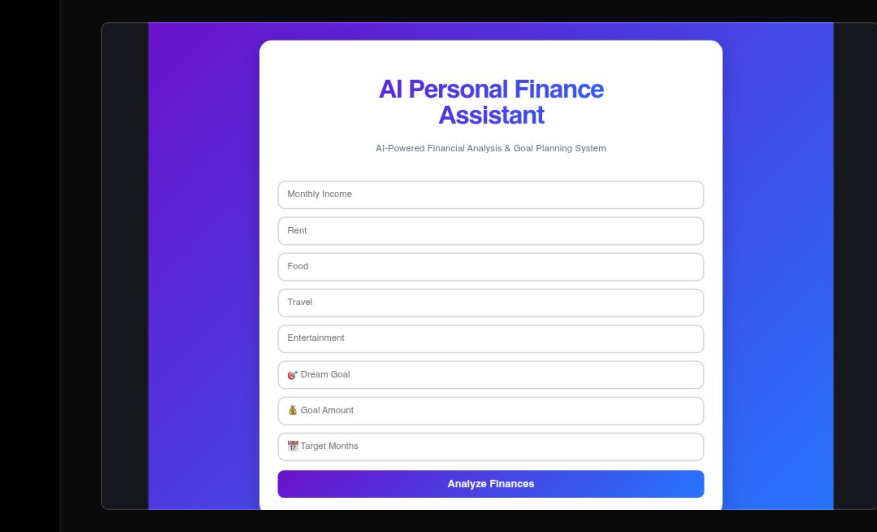
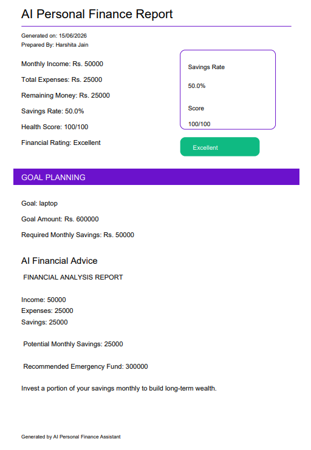

# AI Personal Finance Assistant

An AI-powered Personal Finance Assistant built with React, Vite, Firebase, Recharts, and jsPDF.

## Features

* Financial Health Score
* Budget Analysis
* Expense Breakdown Chart
* Goal Planning System
* Emergency Fund Calculator
* AI Financial Advice
* PDF Report Generation
* Firebase Authentication
* Responsive Modern UI

## Tech Stack

* React
* Vite
* Firebase
* Recharts
* jsPDF
* JavaScript
* CSS

## Screenshots

### Dashboard



### Analysis Results




## Installation

```bash
npm install
npm run dev
```

## Live Demo

https://ai-personal-finance-assistant-491i.vercel.app/
## Author

Harshita Jain
